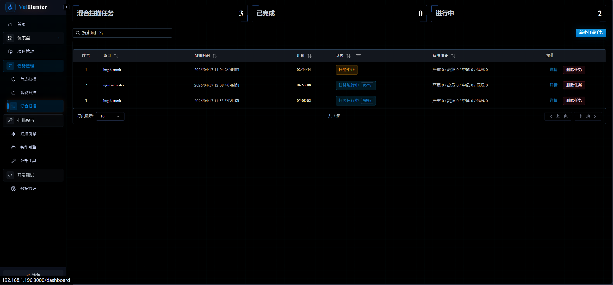
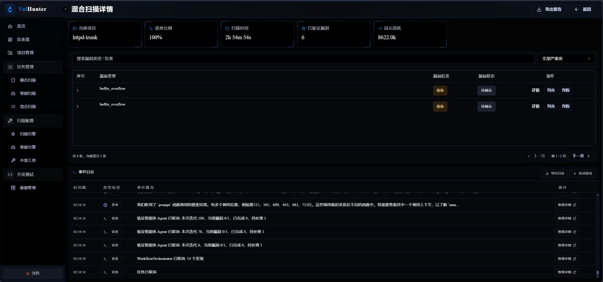

## Feat
- [ ] 添加文件审计功能
- [x] 前端文件/智能/混合扫描详情与任务管理页展示阶段进度
  - 详情页：文件/智能扫描 `侦查 → 分析 → 验证 → 完成`，混合扫描 `静态扫描 → 侦查 → 分析 → 验证 → 完成`
  - 任务管理页：运行中任务由百分比改为同口径阶段标签
  - 规划与实现见 `docs/progress/agent-detail-stage-progress-plan.md`
## Refactor
- [x] 重构Recon
- [x] 优化文件上传功能，调整为异步

## Fix
- [x] backend 报错。unclosed client session

- [x] 静态扫描详情页打开时间比较长 → 改为分页查询（后端 unified 分页接口 + 前端服务端分页）
- [x] 漏洞详情页返回时总是返回到第一页 → 记录跳转前状态（URL 持久化 + returnTo 保留分页/筛选）
- [ ] 扫描详情显示有漏洞，但是任务栏看不到

  - 修复规划见 `docs/verification-taskbar-sync-plan.md`
- [ ] 漏洞不存在或已被清理

